# Multiforum

This is a work in progress that intended to be an open-source, self-hosted platform that lets you host multiple forums.

Each forum has two sections, a discussion section and a calendar. In the discussion section, content
can be upvoted so that the best content rises to the top. In the event section, anyone can post
an event that participants in the community may be interested in. Screenshots are below.

To solve the problem where you're bored on the weekend but you don't know what to do in your area, events can be searched across multiple forums based on location, tags and keyword. Screenshots are below.

When the project is finished, I will add documentation so that anyone can deploy their own Multiforum with custom branding.

## Technology Stack

On the backend (https://github.com/gennit-project/multiforum-backend), an Apollo server fetches data from the database (a graph database, Neo4j). Some resolvers are auto-generated using the [Neo4j graphql library](https://neo4j.com/docs/graphql/current/), while more complex resolvers are implemented using a combination of the [OGM](https://neo4j.com/docs/graphql/current/ogm/) and custom Cypher queries.

The frontend is a Vue application that makes GraphQL queries to the Apollo server.

## Environment Variables

I will fill out this section when the project is finished, or if someone expresses interest in collaborating on this project, whichever comes sooner. Anyone interested can contact me at catherine.luse@gmail.com.

## Tests

Integration tests are in the `cypress` directory and cover all the create, read, update and delete operations on forums, events, discussions and comments, as well as the filtering in the list views.

## Screenshots

The below screenshots capture the state of the project as of January 2024. The layout is responsive with both desktop and mobile views.

### In-person sitewide event search - desktop

This view lets you search events across multiple forums. By default they are filtered to show events that are happening soon.

Note: All screenshots are using fake test data.

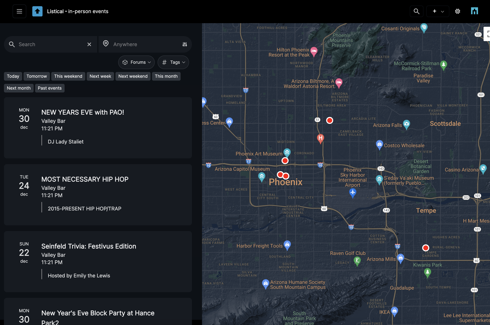

If you hover over a location, you see what is happening there:

If you click the map marker, you see event details:

If you click the event marker for multiple events at the same location, you see a list of what's happening there:

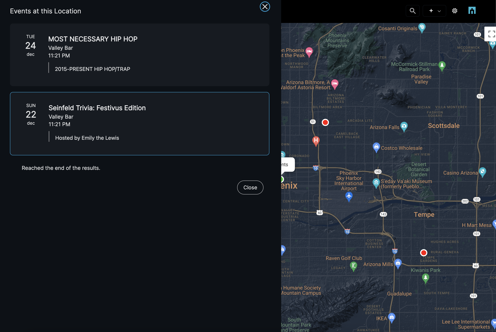

From that list, if you click a list item, you see details of that one event (the same thing you would see if there was only one event at that location).

### Forum detail view - desktop

If you upvote an item, the vote counter becomes blue to show that your vote has been recorded.

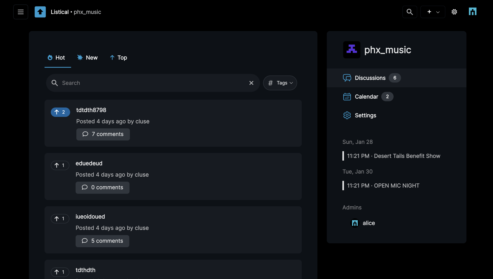

### Event list page within a forum - desktop

The sidebar shows links to events that are coming in the very near future (within 2 weeks). The calendar page shows a full list of events that have been submitted to the channel and allows them to be filtered by time, tag, keywords in the name or description, or location.

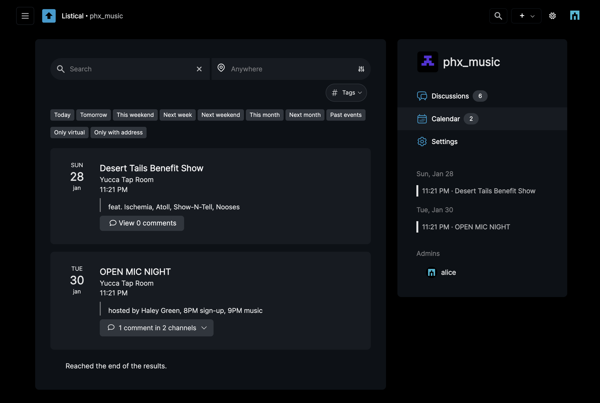

### Discussion detail page with placeholder text - desktop

I intend to let you both upvote and downvote something at the same time. It allows capturing the nuance of something that you think more people should see, but also needs some changes (downvoting is planned to allow the user to submit feedback on the post.)

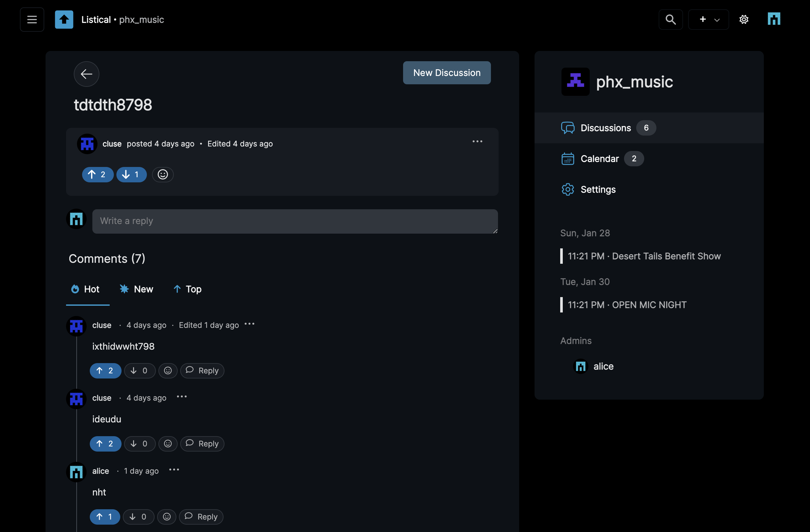

### Forums page on desktop

You can see a list of all the forums hosted on the platform, the number of discussions and the number of upcoming events in each one

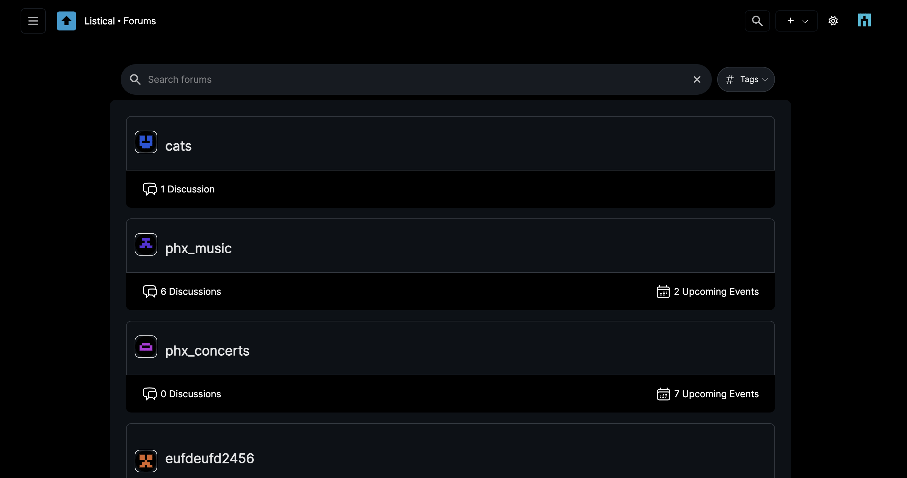

### In-person event search - mobile

This is how it looks if you search in-person events across multiple forums when the screen is at mobile width:

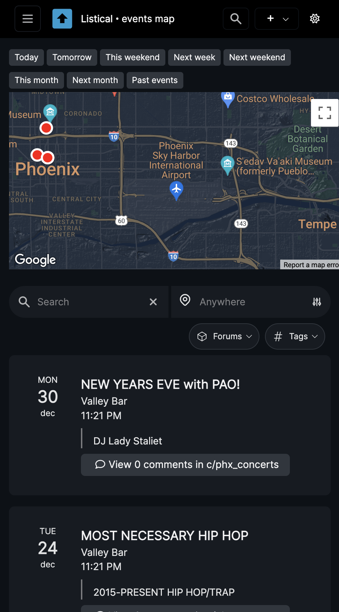

### List of events within channel - mobile

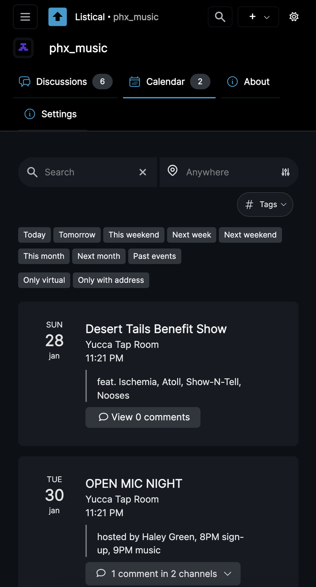

Here is how it looks if you filter by past events:

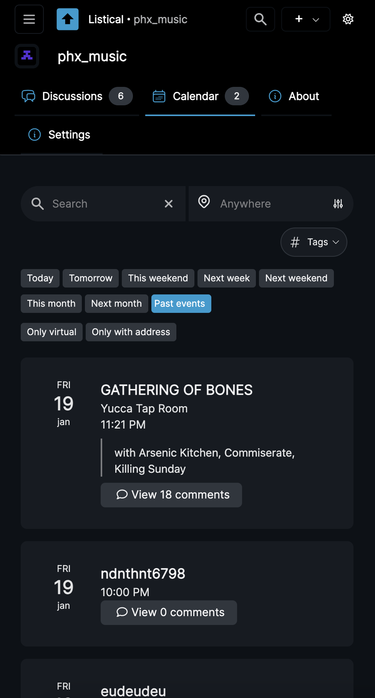

### Event detail page - mobile

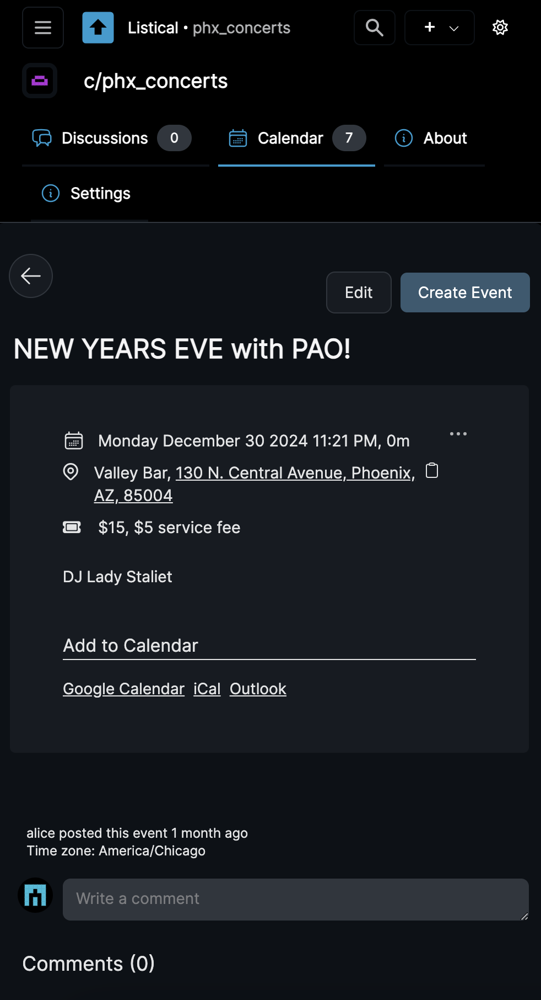

### List of discussions within a forum - mobile

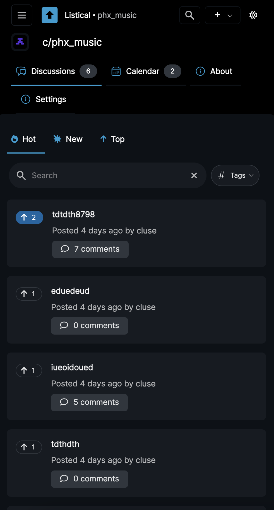

### Discussion detail page - mobile

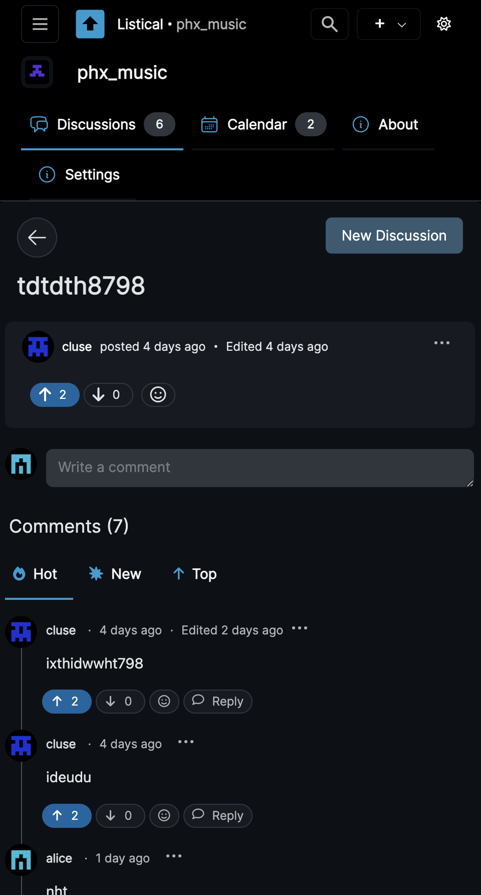

### List of forums - mobile

!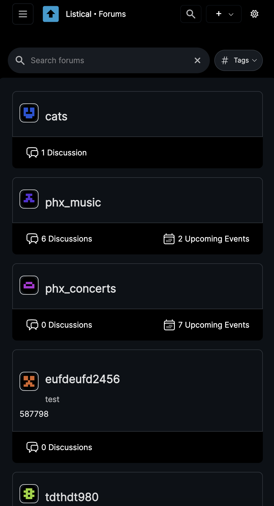